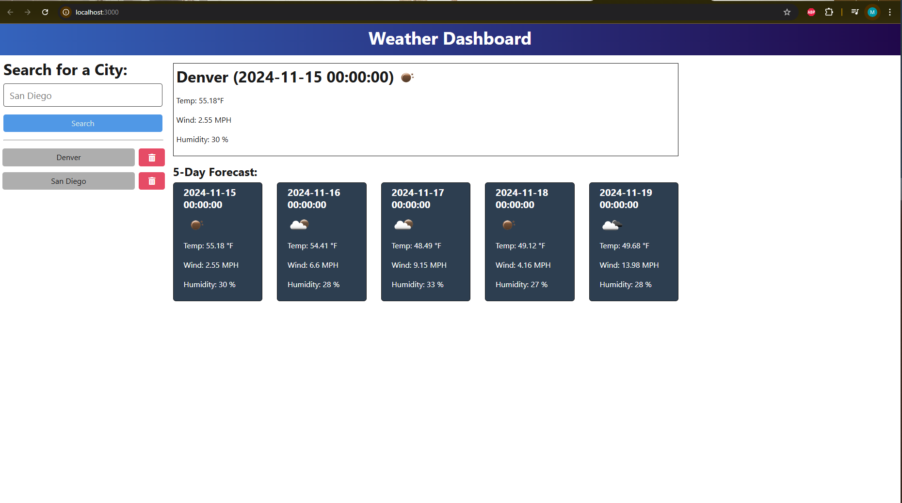

# My Weather Report

## Description
An app/website where you select a city and have its respective weather information displayed.
*NOTE: Please visit and register a free account to https://openweathermap.org/forecast5 to obtain your own API key. This will be required to run the application.

## Table of Contents
- [Installation](#installation)
- [Usage](#usage)
- [Contributing](#contributing)
- [Tests](#tests)
- [Questions](#questions)
- [License](#license)

## Installation
If you would like to access this application locally, then you must download vite, typescript, and node.js (project dependencies). As stated in the description you will also have to get access to your own Open Weather API key. There should be a file called .env.example. That file will already have the API Base URL and under it is where you will enter you Open Weather API key. Rename this file from ".env.example" to "env". 
Otherwise access the webpage: https://my-weather-report.onrender.com

## Usage
Using the application from the repo: In GitBash cd into the folder holding these files and execute "npm install" followed by "npm run start:dev". A window as shown above will appear in your browser and you will be able to view the weather forcast of your cities. The history of searched cities will be show under the "search bar". Click on them to view the forcast again or simply click the red trashcan icon next to it to delete from history.

Otherwise operate the webpage as stated above ande search the city by name.

## License
This project is licensed under the MIT license.
[MIT](https://opensource.org/licenses/MIT)

## Contributing
Mark Sianipar

### Reasources used

- Node.js: [Link](https://nodejs.org/en/download/package-manager)
- Typescript: [LINK](https://www.typescriptlang.org/download/)
- Profesional readMe Guide: [Link](https://coding-boot-camp.github.io/full-stack/github/professional-readme-guide)
- Open Weather API: [Link](https://openweathermap.org/api)
- Vite documentation: [Link](https://vite.dev/)

## Technologies
- HTML
- Node.js
- Type Script
- Vite
- Open Weather API

## Questions
If you have any questions, please feel free to contact me at MerkSianipar@gmail.com.
Github: Marksian

